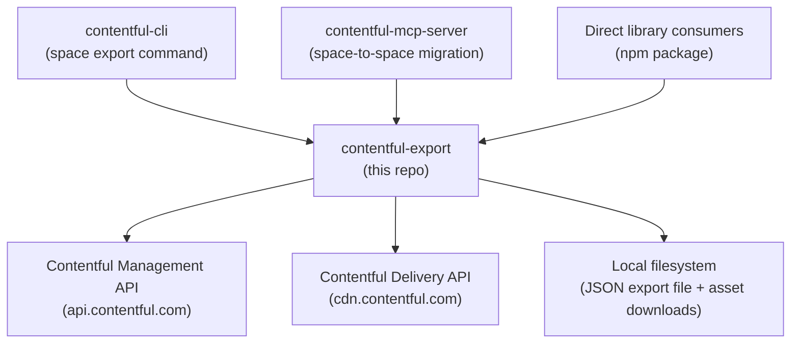

<!-- Generated by seed-golden-context | Last updated: 2026-05-04 -->
# Architecture

## Overview

`contentful-export` is a Node.js library and CLI tool that exports the full content model, content, and assets from a Contentful space (or environment) to a JSON file. It orchestrates paginated reads against the Contentful Management API (CMA) and optionally the Content Delivery API (CDA), downloads asset files, and writes the aggregated result to disk. It is the export half of the Contentful export/import toolchain.

## System Context

## Internal Structure

| Directory / File | Purpose |
|---|---|
| `lib/index.js` | Main entry point. Orchestrates the export pipeline using Listr tasks: init client, fetch space data, download assets, write export file. |
| `lib/parseOptions.js` | Merges defaults, config file, and user-supplied params. Validates required fields (`spaceId`, `managementToken`). Processes proxy settings, query strings, and file paths. |
| `lib/tasks/init-client.js` | Creates CMA and/or CDA client instances using `contentful-management` and `contentful` SDKs. |
| `lib/tasks/get-space-data.js` | Paginated fetching of all entity types (content types, entries, assets, locales, tags, webhooks, roles, editor interfaces). Handles draft/archived filtering and tag stripping. |
| `lib/tasks/download-assets.js` | Downloads asset binary files to disk with concurrency of 6. Handles embargoed (signed URL) assets. |
| `lib/usageParams.js` | Yargs CLI argument definitions. Consumed by the `bin/contentful-export` CLI entry point. |
| `lib/utils/embargoedAssets.js` | JWT-based URL signing for embargoed (secure) assets. Caches asset keys per space/environment. |
| `lib/utils/headers.js` | Parses custom HTTP header strings (`-H "Key: Value"`) into an object for API requests. |
| `bin/contentful-export` | CLI entry point. Requires the built `dist/` output, prints a redirection notice pointing users to `contentful-cli`, then runs the export. |
| `types.d.ts` | Hand-maintained TypeScript type declarations for the public API (`Options` interface and default export). |
| `dist/` | Babel-compiled output (CJS). Generated by `npm run build`, not checked into git. |

## Data Flow

1. **Option parsing** -- User passes options (programmatic or CLI). `parseOptions` merges defaults, config file, and params. Validates required fields.
2. **Client initialization** -- Creates a CMA client. If `deliveryToken` is provided (and `includeDrafts` is false), also creates a CDA client for fetching published-only entries/assets.
3. **Paginated fetching** -- `get-space-data.js` connects to the space/environment, then fetches each entity type in sequence using `pagedGet` (page size = `maxAllowedLimit`, default 1000, ordered by `sys.createdAt,sys.id`). Entries and assets are post-filtered for drafts/archived status and optionally have tags stripped.
4. **Asset download** (optional) -- If `downloadAssets` is true, asset files are streamed to disk under `exportDir/<host>/<path>`. Embargoed assets are signed via the asset_keys API with a 6-hour expiry window before download.
5. **JSON export** -- The aggregated data object is written to disk using `bfj` (Big-Friendly JSON) for streaming large JSON writes without exhausting memory.
6. **Summary** -- A table of exported entity counts is printed, along with duration and file path.

## Domain Concepts

| Concept | Description |
|---|---|
| **Space** | Top-level container in Contentful. Export targets one space at a time. |
| **Environment** | A branch of a space's content. Defaults to `master`. Webhooks and roles can only be exported from the `master` environment. |
| **Content Model** | The set of content types, locales, and editor interfaces that define the structure of content. |
| **Embargoed Assets** | Assets hosted on `*.secure.*` domains that require JWT-signed URLs for access. The tool creates short-lived signed URLs via the `asset_keys` API. |
| **Draft / Archived** | Entries and assets can be in draft (no `publishedVersion`) or archived (`archivedVersion` set) states. By default, only published items are exported. |
| **CDA vs CMA export** | CMA returns all versions (latest, including unpublished changes). CDA returns only the published version. Providing a `deliveryToken` switches entry/asset fetching to CDA. Tags are CMA-only and will not be exported via CDA. |

## Key Dependencies

| Dependency | Why it's here |
|---|---|
| `contentful-management` (v12) | CMA client for fetching space data. v12 requires Node >=22. |
| `contentful` (v11) | CDA client, used when `deliveryToken` is provided for published-only export. |
| `contentful-batch-libs` (v11) | Shared utility library for Contentful export/import tools: logging, error handling, task wrapping, proxy utilities, sequence headers. |
| `bfj` (v9) | Big-Friendly JSON -- streaming JSON serializer for writing large export files without memory exhaustion. |
| `listr` | Task runner that provides structured progress output (spinner or verbose renderer for CI). |
| `bluebird` | Promise library used for `Promise.map` with concurrency control (pagination, asset downloads). |
| `yargs` (v18) | CLI argument parsing. |
| `axios` (v1) | HTTP client for downloading asset files. |
| `jsonwebtoken` | JWT signing for embargoed asset URL generation. |
| `date-fns` | Date formatting and duration calculation for export file naming and summary. |

## Configuration

| Variable / Flag | Purpose | Default |
|---|---|---|
| `spaceId` | Space to export (required) | -- |
| `managementToken` | CMA API token (required) | -- |
| `environmentId` | Environment within the space | `master` |
| `deliveryToken` | CDA token; switches entry/asset fetching to published-only | -- |
| `exportDir` | Directory for output files | `process.cwd()` |
| `saveFile` | Whether to write JSON to disk | `true` |
| `maxAllowedLimit` | Items per API page request | `1000` |
| `downloadAssets` | Download asset binary files to disk | `false` |
| `includeDrafts` | Include draft entries/assets | `false` |
| `includeArchived` | Include archived entries/assets | `false` |
| `contentOnly` | Only export entries and assets (sets `skipRoles`, `skipContentModel`, `skipWebhooks` to true) | `false` |
| `skipContentModel` / `skipContent` / `skipRoles` / `skipWebhooks` / `skipTags` / `skipEditorInterfaces` | Granular skip flags | all `false` |
| `stripTags` | Remove tags from exported entries/assets | `false` |
| `host` | CMA API host | `api.contentful.com` |
| `hostDelivery` | CDA host | `cdn.contentful.com` |
| `proxy` / `rawProxy` | HTTP proxy configuration | -- / `false` |
| `useVerboseRenderer` | Line-by-line output instead of spinner (useful for CI) | `false` |
| `config` | Path to JSON config file with all options | -- |

### CI Environment Variables

These are used in the GitHub Actions check workflow for integration tests:

| Variable | Purpose |
|---|---|
| `MANAGEMENT_TOKEN` | CMA token for test space |
| `DELIVERY_TOKEN` | CDA token for test space |
| `EXPORT_SPACE_ID` | Space ID for integration tests |
| `EXPORT_SPACE_ID_EMBARGOED_ASSETS` | Space ID for embargoed asset tests |

## Operational Knowledge

### Deployment

This is an npm library, not a deployed service. Releases happen automatically via `semantic-release` when commits are pushed to `main` (stable) or `beta` (prerelease) branches. The release workflow retrieves credentials from HashiCorp Vault (visible in `.github/workflows/release.yaml`).

- **Rollback:** Unpublish or publish a patched version to npm. There is no service to roll back.
- **Beta channel:** Pushing to the `beta` branch publishes a prerelease version on the `beta` npm dist-tag.

### Failure Modes

| Failure | Cause | Mitigation |
|---|---|---|
| `400 - Response size too big` | Contentful API response size limits exceeded | Reduce `maxAllowedLimit` (e.g., to 50) |
| Integration test failures in CI | Missing or expired test space credentials (secrets) | Ensure `MANAGEMENT_TOKEN`, `DELIVERY_TOKEN`, `EXPORT_SPACE_ID`, `EXPORT_SPACE_ID_EMBARGOED_ASSETS` secrets are valid |
| Embargoed asset download failure | Asset key creation fails or JWT signing error | Check that the space has embargoed assets enabled and the management token has permissions |
| `ContentfulMultiError` | Aggregated errors during export (partial failure) | Check the error log file at the path printed in output |

### Dependency Failure Behavior

This library depends on the Contentful Management and Delivery APIs at runtime. If those APIs are unavailable:

| Scenario | Behavior |
|---|---|
| CMA unreachable (network failure, DNS, timeout) | Export fails immediately with an Axios network error. No partial output is written. |
| CMA returns 5xx errors | The SDK retries with exponential backoff (built into `contentful-management`). After retries are exhausted, the export fails with the error aggregated into `ContentfulMultiError`. |
| CDA unreachable (when `deliveryToken` is provided) | Same as CMA — network error or retry exhaustion leads to export failure. |
| Rate-limited (429) | The SDK handles 429 responses with automatic retry after the `X-Contentful-RateLimit-Reset` header delay. Large spaces may see slow exports but will eventually complete unless the rate limit is persistently exceeded. |
| Asset CDN unreachable (during `downloadAssets`) | Individual asset downloads fail after Axios timeout. The export completes but reports failed asset downloads in the error log. |

There is no partial-export resume capability — a failed export must be retried from scratch.

## Integration Points

### Upstream (this repo consumes)

- **Contentful Management API** (`api.contentful.com`) -- Primary data source for all entity types
- **Contentful Delivery API** (`cdn.contentful.com`) -- Optional, for published-only entry/asset export
- **Contentful Asset Keys API** -- For signing embargoed asset download URLs
- **contentful-batch-libs** -- Shared logging, error handling, and utility functions

### Downstream (consumes this repo)

- **contentful-cli** (`contentful space export` command) -- Primary CLI consumer; the standalone CLI in this repo redirects users here
- **contentful-mcp-server** -- Uses this library for space-to-space migration export step
- **Direct npm consumers** -- Anyone importing `contentful-export` as a library
